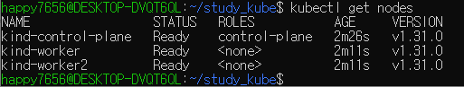

# **패키지 매니저 및 OS 환경 세팅**

---

- Windows
  로컬에 충분한 리소스가 존재하여야 합니다. 만약 리소스가 부족하여 아래의 환경 구축이 힘든 경우 스터디 리더에게 문의주세요.
  1. window의 경우 WSL을 기반으로 환경 구축을 진행합니다. WSL이 로컬에 설치되어있지 않으신 분들은 아래의 블로그를 참조하여 환경을 구성해주세요.
  2. Docker Desktop 설치 후 WSL 과 연동하는 과정을 진행해주세요.
  3. kubectl을 사용해서 실습을 진행합니다.kubectl을 설치해주세요.
     WSL 설치하기
     [https://web-yiyeon.tistory.com/12](https://web-yiyeon.tistory.com/12)
     WSL과 Docker를 연동하기(Docker Destktop 설치 필요)
     [https://okms1017.tistory.com/110](https://okms1017.tistory.com/110)
     kubectl 설치
     [https://kubernetes.io/ko/docs/tasks/tools/install-kubectl-linux/](https://kubernetes.io/ko/docs/tasks/tools/install-kubectl-linux/)

개발 환경은 Kind라는 쿠버네티스 클러스터를 쉽게 생성해주는 도구를 사용합니다.

# Kind란?

---

Kubernetis in Docker를 줄인 말이다. 말 그대로 k8s의 컨트롤 노드와 워커 노드를 vm이 아닌 컨테이너로 띄워 k8s 클러스터를 구축하는 것이다.

## kubectl 자동완성

```bash
apt update
apt-get install bash-completion

source /usr/share/bash-completion/bash_completion
echo 'source <(kubectl completion bash)' >>~/.bashrc
echo 'alias k=kubectl' >>~/.bashrc
echo 'complete -o default -F __start_kubectl k' >>~/.bashrc
```

## kind 설치

```bash
# For AMD64 / x86_64
[ $(uname -m) = x86_64 ] && curl -Lo ./kind https://kind.sigs.k8s.io/dl/v0.30.0/kind-linux-amd64
# For ARM64
[ $(uname -m) = aarch64 ] && curl -Lo ./kind https://kind.sigs.k8s.io/dl/v0.30.0/kind-linux-arm64
chmod +x ./kind
sudo mv ./kind /usr/local/bin/kind
```

혹은 이렇게 설치

```bash
curl -Lo ./kind https://kind.sigs.k8s.io/dl/v0.24.0/kind-linux-amd64
chmod +x ./kind
sudo mv ./kind /usr/local/bin/kind
```

```bash
kind --version
```

## kind를 이용한 k8s 클러스터 구축

```bash
kind: Cluster
apiVersion: kind.x-k8s.io/v1alpha4
nodes:
- role: control-plane
  extraPortMappings:
  - containerPort: 30080
    hostPort: 80
    protocol: TCP
- role: worker
- role: worker
```

```bash
kind create cluster --config 생성한파일이름.yaml
```

위와 같이 생성을 진행한 후 설치가 완료되면 아래와 같은 명령어로 노드가 추가됬는지 확인합니다.

```bash
kubectl get nodes
```

위 명령어의 결과  


참고 https://kmaster.tistory.com/26

다음 명령어로 모든 구성요소들을 한번 확인해보자!

```bash
kubectl get all -A
```

```bash
happy7656@DESKTOP-DVQT6QL:~/study_kube$ kubectl get all -A
NAMESPACE            NAME                                             READY   STATUS    RESTARTS   AGE
kube-system          pod/coredns-6f6b679f8f-js2bw                     1/1     Running   0          5m3s
kube-system          pod/coredns-6f6b679f8f-s8k49                     1/1     Running   0          5m3s
kube-system          pod/etcd-kind-control-plane                      1/1     Running   0          5m10s
kube-system          pod/kindnet-84mml                                1/1     Running   0          4m58s
kube-system          pod/kindnet-gv8zb                                1/1     Running   0          4m58s
kube-system          pod/kindnet-mcd6k                                1/1     Running   0          5m4s
kube-system          pod/kube-apiserver-kind-control-plane            1/1     Running   0          5m10s
kube-system          pod/kube-controller-manager-kind-control-plane   1/1     Running   0          5m10s
kube-system          pod/kube-proxy-98bqp                             1/1     Running   0          4m58s
kube-system          pod/kube-proxy-cnn8g                             1/1     Running   0          5m4s
kube-system          pod/kube-proxy-ph2js                             1/1     Running   0          4m58s
kube-system          pod/kube-scheduler-kind-control-plane            1/1     Running   0          5m10s
local-path-storage   pod/local-path-provisioner-57c5987fd4-6d2xt      1/1     Running   0          5m3s

NAMESPACE     NAME                 TYPE        CLUSTER-IP   EXTERNAL-IP   PORT(S)                  AGE
default       service/kubernetes   ClusterIP   10.96.0.1    <none>        443/TCP                  5m11s
kube-system   service/kube-dns     ClusterIP   10.96.0.10   <none>        53/UDP,53/TCP,9153/TCP   5m10s

NAMESPACE     NAME                        DESIRED   CURRENT   READY   UP-TO-DATE   AVAILABLE   NODE SELECTOR            AGE
kube-system   daemonset.apps/kindnet      3         3         3       3            3           kubernetes.io/os=linux   5m8s
kube-system   daemonset.apps/kube-proxy   3         3         3       3            3           kubernetes.io/os=linux   5m10s

NAMESPACE            NAME                                     READY   UP-TO-DATE   AVAILABLE   AGE
kube-system          deployment.apps/coredns                  2/2     2            2           5m10s
local-path-storage   deployment.apps/local-path-provisioner   1/1     1            1           5m7s

NAMESPACE            NAME                                                DESIRED   CURRENT   READY   AGE
kube-system          replicaset.apps/coredns-6f6b679f8f                  2         2         2       5m4s
local-path-storage   replicaset.apps/local-path-provisioner-57c5987fd4   1         1         1       5m4s
```
