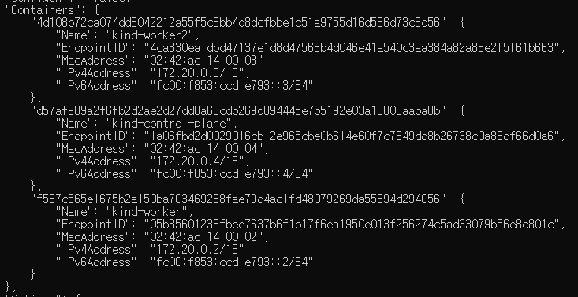
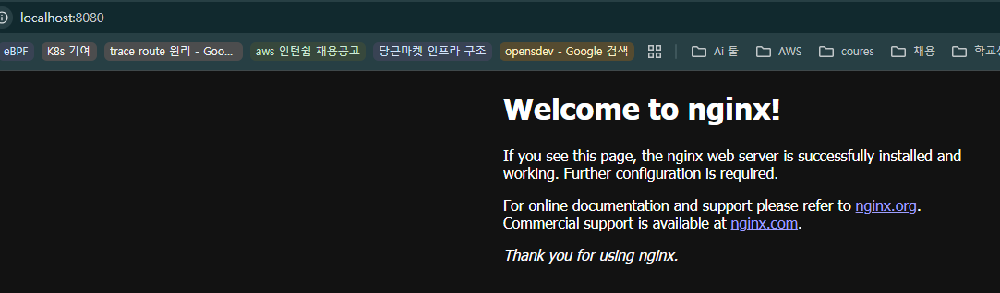
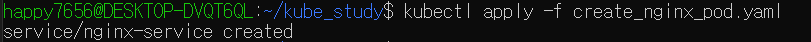

이전 실습에 이어, `kind create cluster --config [.yaml]` 로 다시 클러스터를 동작시킨 후, 그 워커 노드들에 nginx pod를 생성해보자.
```yaml
kind: Cluster
apiVersion: kind.x-k8s.io/v1alpha4
nodes:
- role: control-plane
  extraPortMappings:
    - containerPort: 30080
      hostPort: 80
      protocol: TCP
- role: worker
- role: worker
```

현재 상태  


# `kube run`으로 nginx pod 생성하기
---

```bash
kubectl run nginx --image=nginx --port=80
```
위 명령어를 치면, 자동으로 현재 클러스터에 적절한 워커 노드에 nginx컨테이너를 생성해준다.
- ## 구체적으로 위 명령어를 치면 어떤 과정을 거쳐서 현재 클러스터 노드에 nginx 컨테이너가 생기는 것일까?
- [[kubectl run nginx --image=nginx --port=80를 하게 되면 일어나는 일]]  


## 이때 생성된 nginx 컨테이너를 호스트에서 접속할 수 있을까?

일단은 구성된 node들의 ip주소를 확인해보자!
`kubectl get nodes -o wide`  


만약 `172.20.0.4`로 핑을 보내보면 과연 잘 될까?   

잘 안된다. 
- 당연하게도 위 노드들(컨테이너)의 ip주소는 도커 브릿지 네트워크 내부의 주소이기 때문이다.
- 현재 위 컨테이너(kind로 만든 노드들)은 `kind`라는 bridge를 사용이다.

한번 `docker network inspect kind`로 자세히 보자  

- Subnet : 172.20.0.0/16
- Gateway: 172.20.0.1  


- 총 3개의 컨테이너(클러스터를 구성하는 워커노드 두 개와 컨트롤 플래인 하나)
- 실제 vm대신 kind라는 실습 도구는 이렇게 컨테이너를 노드 삼아 클러스터를 구축한다.


대략적으로 다음과 같은 구조이다.   


당연히 해당 노드(컨테이너)에 접속이 안된다면, 그 노드에서 돌아가는 파드(nginx컨테이너)에도 접속할 수가 없다.   


그렇다면, 직접 노드(컨테이너)들 중 하나에 접속해서 다른 컨테이너에 핑을 날리면 되지 않을까? 한번 시도해보자. 

다음은 control-plane 노드(컨테이너)에 접속하는 명령어와 ping을 설치하는 명령어이다. 

```bash
docker exec -it kind-control-plane bash \
apt-get update && apt-get install -y iputils-ping curl
```

직접 control plane에 접속하고 다른 워커 노드에 핑을 날려보자!
```
ping -c 3 172.20.0.3 # worker node 2의 주소
```  

잘 된다!

그럼 worker node 2에 현재 동작 중인 nginx pod로 ping과 http요청을 해보자
```
ping -c 3 10.244.1.2 # worker node 2의 nginx pod ip 주소로 ping
```  


```
curl 10.244.1.2 # nginx pod로 http get요청
```  

같은 네트워크 상의 컨테이끼리는 통신이 잘 됨을 확인할 수 있다. 

그럼, 이 컨테이너 간의 네트워크 밖(host)에서 컨테이너로 통신이 되게끔 하려면 어떻게 해야할까?

다음과 같이 현재 80포트로 통신하고있는 nginx 컨테이너와 호스트이 8080포트를 이어주는 포트포워딩을 해보자
```
kubectl port-forward pod/nginx 8080:80
```  


이러면, 현재 브라우져나 curl로 localhost:8080을 접속하면 다음과 같이 nginx페이지가 잘 나오게 된다.   
  


물론 단순히 포트포워딩만 해준 것이기에 여전히 직접 노드(컨테이너)와 pod에 curl로 pod ip에 http 요청을 보내거나, ping(ICMP)를 보내보면 응답이 없다. 

# yaml 파일을 작성하여 nginx pod 만들어보기 
---

참조자료 : https://labex.io/ko/tutorials/kubernetes-deploy-a-kubernetes-nginx-pod-433745

create_nginx_pod.yaml
```yaml
apiVersion: v1
kind: Pod
metadata:
  name: nginx-pod #이것이 생성할 pod의 Name이 되어준다. 
  labels:
    app: nginx
spec:
  containers:
    - name: nginx
      image: nginx:latest
      ports:
        - containerPort: 80
```

다음 명령어로 위 yaml파일로 정의한 pod를 생성한다. 

```
kubectl apply -f create_nginx_pod.yaml
```  


get pod -o wide로 확인해보면, 다음과 같이 nginx-pod 라는 이름의 pod가 생성된 것을 확인할 수 있다. 
- 별도로 어떤 노드(컨테이너)에 생성할지 지정하지 않아도, kubectl명령어를 쓰면 적절히 스케쥴링되어 적당한 노드에 pod를 생성해준다. 
- 이미 kind-worker2 노드에는 돌아가고 있는 pod가 있기에 아무것도 없는 kind-woker노드를 스케쥴링해준 모습이다.   


이제 이 pod 컨테이너와 포트포워딩해서 외부, 즉 호스트에서 접속 가능하게 해보자!
```
kubectl port-forward nginx-pod 80:80
```

위 명령어로 바로 로컬의 80 포트에 바로 포트포워딩을 해주려 하면 다음과 같은 에러를 마주한다. 
```
Unable to listen on port 80: Listeners failed to create with the following errors: [unable to create listener: Error listen tcp4 127.0.0.1:80: bind: permission denied unable to create listener: Error listen tcp6 [::1]:80: bind: permission denied]
error: unable to listen on any of the requested ports: [{80 80}]
```
- permisiion denied 라는 문구가 뜬다.. 즉 권한에 문제가 있다는 의미이다. 

조금 찾아보니 리눅스(WSL 포함)에선 **1024 미만 포트는 특권 포트**라서 **root 또는 CAP_NET_BIND_SERVICE 권한**이 있어야 bind가 된다고 한다. 가장 간단한 해결책은 1024 이상의 포트번호를 쓰면 되지만, 한번 80포트로 bind해보도록 한다. 

권한이 없으니 sudo를 붙여 root권한으로 해주면 된다, 그전에 sudo로 kubectl을 해주면, .kube/config의 경로를 찾지 못하기에 다음과 같이 환경 변수로 지정해주자.

```
export KUBECONFIG="$HOME/.kube/config"
```
확인은 다음과 같이 env명령어로 할 수 있다.  


이렇게 해도 여전히 안된다... 당연하게도, 현재 유저모드에서 환경변수 설정을 해봤자 루트모드에서의 환경변수가 변경되지는 않는다.   


이것의 원인이 정확히 무엇인지 한번 알아보자!

로컬에서 `kubectl …`을 칠 때마다, `kubectl`은 kubeconfig에 적힌 server 주소로 HTTPS 요청을 보낸다. 
- 참고로 `kubectl version --client`, `kubectl config …` 처럼 로컬 파일만 다루는 명령은 서버 없이도 된다. 
- 리소스 조회/생성/수정/삭제 등은 전부 control plane에 존재하는 k8s API 서버로 REST 호출을 한다. 

kind는 클러스터를 만들 때 호스트의 127.0.0.1:<랜덤포트> → control-plane:6443로 포트를 매핑해 두므로,  kubeconfig엔 보통 `server: https://127.0.0.1:<랜덤포트>` 와 같은 정보가 들어있다. 

직접 다음 명령어로 현재 .kube/config의 정보를 확인해보자. 
```
kubectl config view
```
- 물론 직접 cat ~./kube/config로 봐도 된다.
```yaml
happy7656@DESKTOP-DVQT6QL:~/kube_study$ kubectl config view
apiVersion: v1
clusters:
- cluster:
    certificate-authority-data: DATA+OMITTED
    server: https://127.0.0.1:38433
  name: kind-kind
contexts:
- context:
    cluster: kind-kind
    user: kind-kind
  name: kind-kind
current-context: kind-kind
kind: Config
users:
- name: kind-kind
  user:
    client-certificate-data: DATA+OMITTED
    client-key-data: DATA+OMITTED
```

- 위 결과에서 확인할 수 있듯 `server: https://127.0.0.1:38433` 라는 것이 있다. 

이것이 의미하는 바는, 현재 내 노트북의 127.0.0.1:38433가 kube-apiserver 엔드포인트로 쓰인다는 것이다. 직접 한번 이 주소로 http 접속해보면 다음과 같은 문구가 뜬다.  


다시, 원래 문제로 돌아와서, 왜 sudo kubectl port-foward 80:80을 하면 왜 안될까?
- 일단, root port라 권한 문제가 발생한다는 점은 sudo로 권한을 줌으로 해결했다. 
- 이때, kubectl은 kube/config 파일을 통해 k8s api서버의 주소와 포트를 알아내어 통신하는데, 현재 sudo로 root에 진입하면 거기에는 kube/config가 없는 상황이다. 
	- 그냥 유저모드에서 env설정한다고, root의 env도 변경되는 것이 아니다. 
- 즉 현재 생기는 문제점은, kubectl이 kube/config파일을 읽지 못해, 등록된 k8s api서버가 아니라 그냥 기본값이 localhost:8080에다가 요청을 날려 생기는 것이다. 
- 그럼 kube/config파일을 root에서도 읽게 해주면 된다. 

이를 해결하는 방법은 다음과 같다. 직접 sudo에 kubeconfig 경로 주입하면 된다. 
```
sudo env "KUBECONFIG=$HOME/.kube/config" kubectl port-forward nginx-pod 80:80
```


근데.. 현재 kind로 구축한 control plane이 80포트를 쓰고 있으니, 90포트로 포트포워딩 해주는걸로 하자

```
sudo env "KUBECONFIG=$HOME/.kube/config" kubectl port-forward nginx-pod 90:80
```  

  


# service를 생성하고, 로컬에서 pod에 curl보내기 
---
다음과 같이 기존의 create_nginx_pod.yaml파일을 수정해준다. 
- 이때 구분자(---)를 꼭 넣어줘야 한다.
```yaml
apiVersion: v1
kind: Pod
metadata:
  name: nginx-pod
  labels:
    app: nginx
spec:
  containers:
    - name: nginx
      image: nginx:latest
      ports:
        - containerPort: 80
---
apiVersion: v1
kind: Service
metadata:
  name: nginx-service
spec:
  type: NodePort
  selector:
    app: nginx
  ports:
    - protocol: TCP
      port: 80
      targetPort: 80
      nodePort: 30080
```

이후 다시 위 yaml파일을 적용해 service를 생성하자  



확인해보면 다음과 같이 service가 생성 된 것을 확인할 수 있다.   


이제 포트포워딩 없이 호스트에서 curl 127.0.0.1을 하면 nginx페이지가 잘 보인다.   

